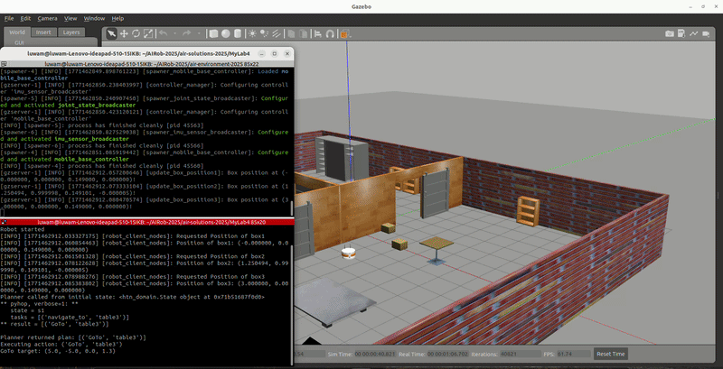

# Hybrid Planning and Semantic Reasoning for Mobile Agents

> **Academic Context:** Developed as part of the *Artificial Intelligence and Robotics (2025)* curriculum at the **Alma Mater Studiorum – University of Bologna**, under the direction of **Prof. Alessandro Saffiotti**.

This repository contains the implementation of an autonomous cognitive robotic agent built in ROS2 and Gazebo. Designed as a complete **Sense-Plan-Act** system, the agent bridges high-level symbolic reasoning with low-level reactive control to navigate, manipulate objects, and recover from failures in unconstrained, multi-room environments.

Unlike standard end-to-end deep learning navigation systems, this project relies on a hybrid architecture: it uses **HTN (Hierarchical Task Network) planning** and **OWL knowledge graphs** for semantic reasoning, coupled with **fuzzy logic controllers** for real-time obstacle avoidance and physical execution.

## 🎥 Demo

### Navigation: Multi-Room Path Planning

The agent receives a high-level task, generates an HTN plan, and executes it with fuzzy reactive control.

**Navigate to Bed (Parts 1 & 2)**

<p align="center">
  
  
</p>
<p align="center">
  <em>Left: The agent generates the HTN plan and begins navigating. Right: The agent completes the route to Bed1.</em>
</p>

**Navigate to Table 1**



*A second target in a different room, exercising a different door sequence.*

## 🚀 Key Features

* **Semantic Goal Resolution:** Capable of resolving unstructured, high-level commands (e.g., `"navigate to a Kitchen"`) by querying an OWL knowledge graph via a semantic reasoner (`rdflib`/`owlrl`), automatically translating abstract concepts into concrete spatial targets.
* **Failure Detection & Autonomous Recovery:** Engineered to handle "map-reality inconsistencies." If the agent encounters a displaced box, an unexpectedly closed door, or an unknown entity, it detects the failure, halts execution, and dynamically re-plans.
* **Fuzzy Reactive Control:** Implements modular fuzzy logic behaviors (`GoToTarget`, `Wander`, `FollowObject`, `CrossDoor`) to translate planned waypoints into safe, collision-free motor commands (`vlin`, `vrot`) using live sonar data.
* **Odometric Drift Correction:** Binds cumulative odometric drift during long multi-room tours by fusing raw wheel-encoder data with map priors (e.g., snapping to known door/wall coordinates), validated against Gazebo ground truth.

## 🧠 System Architecture (Sense-Plan-Act)

1. **Sense (Perception & Localization):** 
   - Tracks global pose `(x, y, θ)` via odometry.
   - Processes real-time sonar arrays for obstacle detection and clearance checking.
   - Queries the environment state via ROS2 services.
2. **Plan (Cognition):** 
   - Uses **Pyhop** (a Python HTN planner) to decompose top-level tasks (e.g., `transport box1 table3`) into executable operators (`GoTo`, `Cross`, `PickUp`, `PutDown`).
   - Integrates the semantic map (`.ttl` Turtle files) to deduce room categorizations and object properties.
3. **Act (Execution):** 
   - Dispatches planned operators to fuzzy rule-based controllers.
   - Continuously monitors execution state to trigger re-planning upon environmental failure.

## 🛠️ Tech Stack
* **Robotics Middleware:** ROS2, Gazebo (Tiago robot simulation)
* **Languages:** Python 3
* **Planning & Reasoning:** Pyhop (HTN Planner), OWL, `rdflib`, `owlrl` (HermiT reasoner)
* **Control:** Custom Fuzzy Logic Engine

## 📂 Classes and Functions
* `/htn_domain/` - Pyhop domain definitions, methods, and operators for multi-room navigation and object manipulation.
* `/fuzzy_control/` - Fuzzy predicates, linguistic variables, and rule bases for reactive behaviors (`GoTo`, `CrossDoor`, `Wander`).
* `/semantic_map/` - Turtle (`.ttl`) ontology files defining the environment, rooms, and object classifications.
* `/core/` - The main `toplevel.py` SPA loop, state estimators, and ROS2 gateway nodes.

## ⚙️ Installation & Usage

### Prerequisites
* ROS2 (Humble/Iron)
* Gazebo
* Python 3.x with `rdflib` and `owlrl` (`pip install rdflib owlrl`)

## 🚀 Running the System
1. **Source the simulation environment:**
   ```bash
   source /path/to/air-environment/install/setup.bash

2. **Launch the Gazebo world:**

```bash
ros2 launch air_environment apartment.launch.py
```

3. **Run the cognitive agent (Top-Level SPA Loop):**

```bash
python3 main_agent.py --task "transport box1 kitchen" --debug 2
```

> **Note:** Use `--debug 2` to trace the HTN plan generation, local state estimations, and fuzzy rule activations in real-time, or `--debug 3` for full fuzzy defuzzification logs.

---

## 🔬 Evaluation & Testing

The system was evaluated against edge-case scenarios including:

- **Dead-ends:** Introducing unexpected obstacles that fully block planned routes.
- **Continuous Drift:** Running indefinite multi-room tours to measure localization divergence with and without map-prior corrections.
- **Semantic Ambiguity:** Requesting the agent to find objects not explicitly instantiated in the asserted graph, requiring the reasoner to infer object classes based on room containment.

---

## 👤 Author

**Luwam Major Kefali**

AI Student/Researcher | Multimodal Learning  | Robotics
